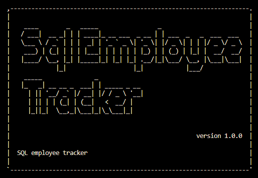
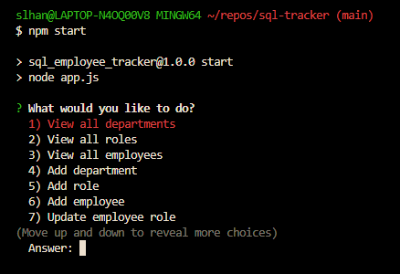

# SQL-Tracker <!-- omit from toc -->
by Sheila Hanson 

## Description <!-- omit from toc -->
- This is a command-line application from scratch to manage a company's employee database, using Node.js, Inquirer, and MySQL.  
  

## Table of Contents <!-- omit from toc -->
  
- [Installation](#installation)
  - [User Story](#user-story)
  - [Acceptance Criteria](#acceptance-criteria)
- [Usage](#usage)
- [Features](#features)
- [Challenges](#challenges)
- [Contributing](#contributing)
- [License](#license)
- [Questions](#questions)
- [Badges](#badges)
    

## Installation
- This program is run with inquirer@8.2.4 and mysql2@3.8.0  
  - npm init  
  - npm install npm i inquirer@8.2.4  
  - npm install i mysql2
  - install console-table  
- Once the dependencies have been install
- Database setup
  - Install MySQL locally
    - Run the schema.sql and seeds.sql files to set up the database schema and initial data  
    - javascript const db = mysql.createConnection  
      - host: "localhost",  user: "root", password: 'your_password_given', database: 'what_you_called_your_db'  
-   Run MySQL in your CUI  
      - enter: mysql -uroot -p  
        - input your password  
      - copy and paste your schema.sql file into your CUI  
      - copy and past your seeds.sql file into your CUI  
      - type: USE 'insert your file name here'_db; into your CUI  
  
  - How to run the employee tracker in your terminal  
       - type "npm start" into the CUI  
       - you will be prompted to answer questions and can navigate the employee tracker

  
  ### User Story
* AS A business owner  
  
I WANT to be able to view and manage the departments, roles, and employees in my company  
SO THAT I can organize and plan my business  

    
  
  ### Acceptance Criteria
* GIVEN a command-line application that accepts user input  
  
WHEN I start the application  
THEN I am presented with the following options: view all departments, view all roles, view all employees, add a department, add a role, add an employee, and update an employee role  

WHEN I choose to view all departments  
THEN I am presented with a formatted table showing department names and department ids  

WHEN I choose to view all roles  
THEN I am presented with the job title, role id, the department that role belongs to, and the salary for that role  

WHEN I choose to view all employees  
THEN I am presented with a formatted table showing employee data, including employee ids, first names, last names, job titles, departments, salaries, and managers that the employees report to  

WHEN I choose to add a department  
THEN I am prompted to enter the name of the department and that department is added to the database  

WHEN I choose to add a role  
THEN I am prompted to enter the name, salary, and department for the role and that role is added to the database  

WHEN I choose to add an employee  
THEN I am prompted to enter the employee’s first name, last name, role, and manager, and that employee is added to the database  

WHEN I choose to update an employee role  
THEN I am prompted to select an employee to update and their new role and this information is updated in the database  

- Database schema showing the three tables that I have created 
- 
  
    
      
## Usage 
- All usage comes from the CLI
  - Termianl command line
    - (type) npm start
      - Use arrow up and down to highlight your choice and hit enter  
      
       - Option 8, 9, and 10 are added functions  

            

      - Showing proper responses to your selection  
      
  - SQL  - Loading/Populating your database -

    - Log into SQL by typing  "mysql -u root -p"  
      - Password = "password"  
      - Copy your schema file and paste into sql - hit enter  
  
           
      -  Copy your seeds file and paste into sql - hit enter  
       
           

-   ### DEMO:  
    - (https://app.screencast.com/Fqo3eB1qLax79)

## Features  
1. Delete Department
2. Delete Role
3. Delete Employee

## Challenges  
- Starting in async/await and switching to promises.  
- Proper syntax for db.query involving SELECT, VALUES, JOIN, INNER JOIN and etc.  
- Had to create E.role_id and M.role_id (employee/manager) because I needed to pull same employees for two different requests.  
- Not realizing how much longer this assignment was going to take.  
- I used mysql2 vs createConnection and it would puke consecutively after calling anything on the 11 time.  
  
- Ran out of time   
  - Testing 
  
## Contributing
[NPM](https://www.npmjs.com/package/inquirer/v/8.2.4?activeTab=readme#installation)  
[Inquirer](https://www.npmjs.com/package/inquirer/v/8.2.4)  
[MySQL](https://www.npmjs.com/package/mysql2)  
[MySQL2](https://sidorares.github.io/node-mysql2/docs/documentation/promise-wrapper)  
[MDN Web Docs](https://developer.mozilla.org/en-US/docs/Web)  
[Node.js](https://nodejs.org/docs/latest/api/)  
[Stack Overflow](https://stackoverflow.com/?newreg=67d94556b887449fa2885dadf54a5439)  
[JS Cheatsheet](https://htmlcheatsheet.com/js/)  
[W3school](https://www.w3schools.com/)  
[DEV](https://dev.to/envoy_/150-badges-for-github-pnk#contact)  
[Shields](https://shields.io/)  
 

## License  
  
This project is licensed under MIT
    

## Questions

If you have any questions, or additional feedback, please feel free to email me and I will respond as soon as possible.
    
* Github -
[https://github.com/Sheila-Ha/sql-tracker](https://github.com/Sheila-Ha/sql-tracker.git)

* Email -
slhanson11@live.com

## Badges
  
  
    
  
    
      
     

